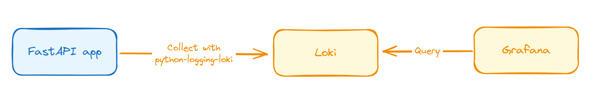

# FastAPI + Loki
A simple project to prove the concept of FastAPI and Loki.
The goal of this was to integrate FastAPI Gunicorn logs and Loki to have a clear, simple and consistent log for debugging/monitoring purposes on a single Grafana dashboard.

## The Architecture

